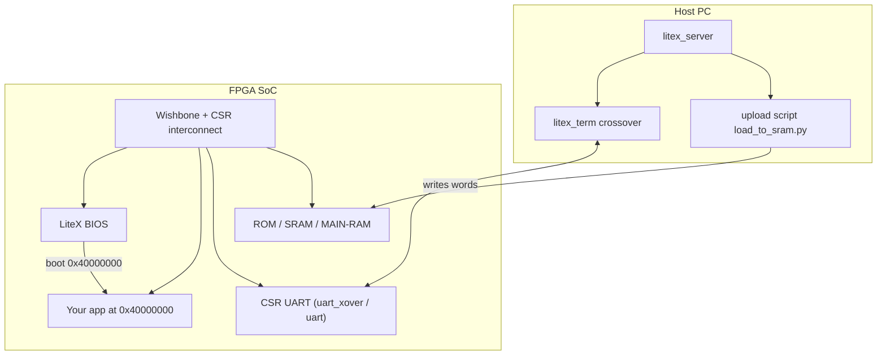

# Custom Bare‑Metal Applications (LiteX BIOS + M2SDR)

This document explains how to build and run a **custom bare‑metal application** on the embedded CPU in the LiteX‑M2SDR SoC, using the LiteX BIOS console and a host bridge (Etherbone/UDP or PCIe).

If you’re new to LiteX/Migen at a high level, read `My-litex.md` first.

## What we are doing

When `--with-cpu` is enabled, the bitstream includes:

- A **soft CPU** (e.g. VexRiscv).
- LiteX **BIOS** (the `litex>` shell).
- A **console UART** (in this repo typically a **CSR-based crossover UART**).
- A memory map with **ROM/SRAM/CSR**, and optionally a separate **main RAM** region for running uploaded programs.

We use this workflow:

1. Keep BIOS available (don’t replace it).
2. Upload an app binary into **main RAM** (at `0x40000000`).
3. In BIOS, run `boot 0x40000000` to jump to the app.

## Why `main_ram` matters (don’t upload into SRAM)

On CPU builds, **`sram` is used by the BIOS runtime** (`.data/.bss/stack`). If you upload your app into `sram` (e.g. `0x10000000`), you will corrupt the running BIOS and often need a power-cycle to recover.

To avoid that, this repo enables a dedicated **integrated main RAM** region (default `0x20000` bytes) at **`0x40000000`**:

- CLI flag: `--integrated-main-ram-size 0x20000`
- Verify it exists: check `scripts/csr.csv` for `memory_region,main_ram,0x40000000,...`

## System architecture (app + BIOS + host bridge)



## Prerequisites (one-time)

- Working SoC build with CPU + main RAM + your chosen host bridge.
- Working `litex_server` transport (Etherbone/UDP recommended for CPU builds on baseboard).
- A matching `scripts/csr.csv` for the currently loaded bitstream.

For setup, build, and console instructions, see `SOC_TEST.md`.

## Example app: `m2sdr_diag`

This repo includes a small demo app:

- Path: `litex_m2sdr/software/baremetal/m2sdr_diag/`
- Output: `m2sdr_diag.bin`
- Behavior: prints a banner + capability summary + self-tests + heartbeat loop.

### Build the app (IMPORTANT: use the matching SoC build directory)

The SoC build directory provides generated headers and linker regions (including `main_ram`):

```bash
cd litex_m2sdr/software/baremetal/m2sdr_diag
make clean
make BUILD_DIR=../../../../build/<your_build_name>
cd -
```

Tip: `<your_build_name>` must be the same build that produced your currently used `scripts/csr.csv` and loaded bitstream.

### Upload app into main RAM

Because Etherbone/UDP is sensitive to bursts, use small chunks and a short delay:

```bash
python3 scripts/load_to_sram.py --csr-csv scripts/csr.csv \
  --file litex_m2sdr/software/baremetal/m2sdr_diag/m2sdr_diag.bin \
  --addr 0x40000000 \
  --chunk-words 4 --delay-ms 1
```

Notes:

- Don’t run `litex_term` and upload scripts at the same time (single-client behavior).
- If the link gets flaky, restart `litex_server` and re-try.

### Boot from BIOS

Open the BIOS console:

```bash
litex_term crossover --csr-csv scripts/csr.csv
```

Then:

```text
litex> boot 0x40000000
```

### Example session transcript (known-good flow)

This transcript shows the typical workflow end-to-end. Key idea: **BIOS memtest overwrites `main_ram` at startup**, so you must upload the binary *after* the BIOS reaches `litex>` (and re-upload after any reboot).

```text
(.venv) govindws@govindws:~/work/project/litex_m2/litex_m2sdr$ litex_term crossover --csr-csv scripts/csr.csv

        __   _ __      _  __
       / /  (_) /____ | |/_/
      / /__/ / __/ -_)>  <
     /____/_/\__/\__/_/|_|
   Build your hardware, easily!

...
MAIN-RAM:    128.0KiB

--========== Initialization ============--

Memtest at 0x40000000 (128.0KiB)...
Memtest OK
...

--============= Console ================--

litex>
```

Exit `litex_term` (Ctrl-C twice), then upload the binary into `main_ram` and verify it:

```text
(.venv) govindws@govindws:~/work/project/litex_m2/litex_m2sdr$ python3 scripts/load_to_sram.py --csr-csv scripts/csr.csv \
  --file litex_m2sdr/software/baremetal/m2sdr_diag/m2sdr_diag.bin \
  --addr 0x40000000 --chunk-words 4 --delay-ms 1 --verify
Writing 5700 bytes to 0x40000000...
Done (14.5 KiB/s).
Verifying (readback)...
Verify OK.
Next: in BIOS run `boot 0x40000000` (or your chosen address).
```

Re-open the console and boot:

```text
(.venv) govindws@govindws:~/work/project/litex_m2/litex_m2sdr$ litex_term crossover --csr-csv scripts/csr.csv

litex> boot 0x40000000
Executing booted program at 0x40000000

--============= Liftoff! ===============--

=============================
 LiteX-M2SDR diag app
=============================
Identifier: LiteX-M2SDR embedded cpu / baseboard variant / built on 2026-05-07 15:50:18
sys_clk   : 0x07735940 Hz
ROM       : 0x00000000 + 0x00008000
SRAM      : 0x10000000 + 0x00010000
MAIN-RAM  : 0x40000000 + 0x00020000
CSR       : 0xf0000000 + 0x00020000

Enabled blocks (CSR presence):
  pcie              : no
  ethernet          : yes
  sata              : no
  gpio              : no
  clk10_discipline  : yes
  time_gen          : yes
  ad9361            : yes
  leds              : yes

Self-tests:
  ctrl_scratch: PASS (0x12345678)
  timer0_value: PASS (0x........ -> 0x........)
  leds_out     : toggling (force on for ~short delay)

Result: PASS

Heartbeat: printing every ~1s. Press reset to exit.
[diag] alive 0x00000001
[diag] alive 0x00000002
[diag] alive 0x00000003
[diag] alive 0x00000004
```

## UART routing gotcha (why prints can be “silent”)

LiteX libc `printf()` normally routes to the SoC’s **main UART** CSRs (`uart_*`). On some LiteX‑M2SDR builds, the BIOS console is on the **crossover UART** (`uart_xover_*`). In that case:

- your app can run correctly
- but `printf()` output appears “missing” because it’s going to the other UART block

The `m2sdr_diag` demo avoids this by writing directly to the UART CSRs, preferring `uart_xover_*` when present.

## References

- LiteX Wiki: [`https://github.com/enjoy-digital/litex/wiki`](https://github.com/enjoy-digital/litex/wiki)
- Load apps via BIOS boot methods: [`https://github.com/enjoy-digital/litex/wiki/Load-Application-Code-To-CPU`](https://github.com/enjoy-digital/litex/wiki/Load-Application-Code-To-CPU)
- Host bridges: [`https://github.com/enjoy-digital/litex/wiki/Use-Host-Bridge-to-control-debug-a-SoC`](https://github.com/enjoy-digital/litex/wiki/Use-Host-Bridge-to-control-debug-a-SoC)

