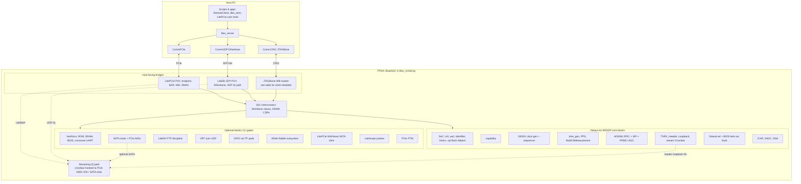
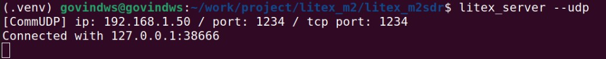
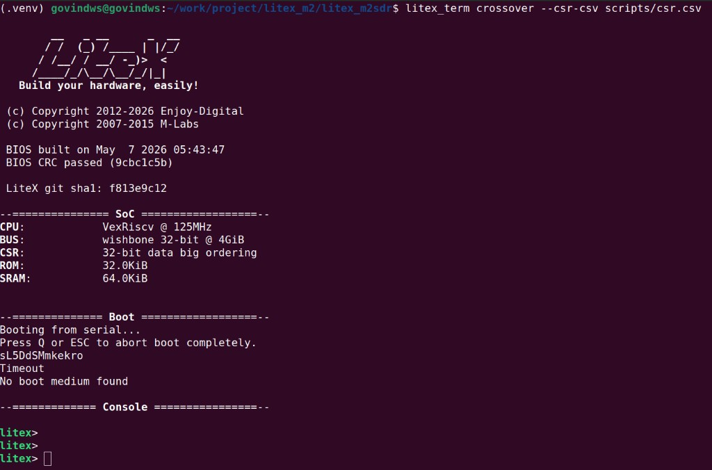

## SoC Test Notes (CPU/BIOS Console)

This repository has optional build support for running the LiteX BIOS on an embedded soft-CPU and getting a console, without changing the default “minimal streaming/control SoC” behavior.

- **CPU/BIOS enablement**: use `--with-cpu` (see `--cpu-type`, `--cpu-variant`, `--integrated-rom-size`, `--integrated-sram-size`, `--no-integrated-rom-auto-size`).
- **Console transport**: BIOS console uses LiteX’s **CSR-based crossover UART**, accessed through a host bridge (`litex_server` over PCIe, **Etherbone/UDP** (needs Ethernet in the gateware), etc.).
- **CSR description file**: tools that talk to CSRs (e.g. `litex_term crossover`, `RemoteClient`) must use a `csr.csv` that matches the loaded bitstream. In this repo it is generated as **`scripts/csr.csv`**.
- **JTAGBone caveat**: when `--with-cpu` is enabled, JTAGBone is disabled automatically (soft-CPU debug and JTAGBone share JTAG). Prefer **Etherbone/UDP** or **PCIe** for the remote link.

### Prerequisites + clone + first build (gateware)

This section is a practical “get to a first bitstream” checklist. Exact package names can vary by distro.

#### Host prerequisites (Ubuntu/Debian)

```bash
sudo apt update
sudo apt install -y \
  git make gcc g++ \
  python3 python3-venv python3-pip \
  libusb-1.0-0-dev
```

Optional but commonly used for bringup:

```bash
sudo apt install -y openocd
```

Optional but recommended for flashing/loading over FTDI/JTAG:

```bash
sudo apt install -y openfpgaloader
```

#### Clone

Recommended: use LiteX’s meta-installer to fetch/install the full LiteX ecosystem into one venv, then clone `litex_m2sdr` alongside it.

```bash
git clone https://github.com/enjoy-digital/litex
cd litex
```

If your checkout uses git submodules (some LiteX setups do), initialize them:

```bash
git submodule update --init --recursive
```

#### Python environment

Create and activate a venv:

```bash
python3 -m venv .venv
source .venv/bin/activate
python -m pip install -U pip setuptools wheel
```

Fetch and install the LiteX ecosystem into this venv:

```bash
python3 litex_setup.py init
python3 litex_setup.py install
```

Then clone and install `litex_m2sdr` (still using the same venv):

```bash
cd ..
git clone https://github.com/enjoy-digital/litex_m2sdr.git
cd litex_m2sdr
pip install -e .
```

#### FPGA toolchain (Vivado)

Building the bitstream requires **Xilinx Vivado**. In each shell where you build, source Vivado’s environment first:

```bash
source /path/to/Xilinx/Vivado/<version>/settings64.sh
```

#### Optional: RISC-V toolchain (only for `--with-cpu`)

If you build with `--with-cpu`, LiteX needs a RISC‑V bare‑metal GCC (e.g. `riscv64-unknown-elf-gcc`) to build the BIOS/software. Install it using your preferred method (distro package, LiteX toolchain helper, or prebuilt toolchain). If you see errors like “unable to find any of the cross compilation toolchains”, this is what’s missing.

#### First build commands

Minimal PCIe build (no CPU):

```bash
./litex_m2sdr.py --with-pcie --variant=baseboard --build
```

CPU + BIOS build:

```bash
./litex_m2sdr.py --with-pcie --variant=baseboard --with-cpu --build
```

CPU + BIOS + Etherbone/UDP build (for the UDP console flow below):

```bash
./litex_m2sdr.py --with-pcie --with-eth --variant=baseboard --with-cpu --build
```

### Architecture overview (host bridge + IPs in this codebase)

The schematic below mirrors the usual LiteX picture (exact bus topology simplifies crossbars and DRAM when `--with-cpu` is off): **host tools** talk to **`litex_server`** transport backends, which reach **FPGA-side bridges**; those bridges sit on the same **SoC interconnect** as **CSRs and memory-mapped IPs**. A separate **streaming dataplane** carries RF samples between **LitePCIe DMA / Ethernet UDP / SATA** (when enabled) and the **AD9361** via the **crossbar**, **TX/RX header**, and **loopback** logic defined in `litex_m2sdr.py`.



**How to read the optional column**

| Approximate gateware block | Typical CLI gate |
|---|---|
| Host bridge PCIe + DMA | `--with-pcie` |
| Etherbone + SFP datapath over UDP | `--with-eth` (baseboard variant) |
| JTAGBone | default; `--without-jtagbone` to drop; suppressed when `--with-cpu` |
| Soft CPU + BIOS crossover console | `--with-cpu` |
| SATA | `--with-sata` |
| Ether PTP extras | `--with-eth --with-eth-ptp` |
| VRT egress | `--with-eth-vrt` |
| Expansion GPIO | `--with-gpio` |
| White Rabbit | `--with-white-rabbit` (+ WR firmware paths) |
| LiteScope ILA | `--with-*-probe` family in `litex_m2sdr.py` |
| PCIe PTM timing | `--with-pcie-ptm` |

### Memory map (ROM / SRAM / CSR) and `csr.csv` reference

The authoritative memory map for a *specific bitstream build* is the generated **`scripts/csr.csv`** file.
If you rebuild the SoC with different options, **always use the new matching `scripts/csr.csv`**.

#### Top-level regions

Look for `memory_region` lines near the bottom of `scripts/csr.csv`, for example:

```text
memory_region,rom,0x00000000,32768,cached
memory_region,sram,0x10000000,65536,cached
memory_region,csr,0xf0000000,131072,io
```

- **`rom`**: CPU reset/BIOS lives here when `--with-cpu` is enabled (size depends on `--integrated-rom-size` and ROM auto-sizing).
- **`sram`**: integrated SRAM for BIOS/runtime when `--with-cpu` is enabled (size depends on `--integrated-sram-size`).
- **`csr`**: CSR/MMIO window. This is where `RemoteClient` and `litex_term crossover` read/write peripheral registers via the host bridge.

#### CSR peripheral base addresses

At the top of `scripts/csr.csv`, `csr_base` lines give each peripheral’s base address inside the CSR window, e.g.:

```text
csr_base,ctrl,0xf0000000,,
csr_base,uart,0xf0000800,,
csr_base,leds,0xf0003800,,
```

Then `csr_register` lines enumerate individual registers and their absolute addresses:

```text
csr_register,ctrl_scratch,0xf0000004,1,rw
csr_register,uart_rxempty,0xf0000808,1,ro
csr_register,leds_out,0xf0003800,1,rw
```

Tip: `csr_base` tells you “where the block starts”; `csr_register` tells you “the exact address to poke”.

### BIOS `leds` command and gateware (`leds.out`)

LiteX BIOS can drive a CSR named **`leds.out`** (`leds_out_write()` in generated software). On M2SDR, the RGB status LED is **not** three separate BIOS GPIOs: the `StatusLed` core implements patterns (breathing, heartbeat, activity, etc.). A **1-bit `out`** CSR is provided so the BIOS **`leds`** command still has a compatible hook: when `leds.out` is non‑zero, the LED is **forced on** atop the animator. That does **not** change hue or scripted blink patterns from the BIOS alone—those come from the gateware animator plus this override.

### Optional: build with an embedded CPU + LiteX BIOS console

By default, the LiteX-M2SDR SoC is built as a minimal control/streaming design (no embedded CPU).
If you want a **soft-CPU + BIOS** for quick experiments or a small bare-metal app, enable it with `--with-cpu`.

**PCIe-only build** (no on-board Etherbone unless you also enable Ethernet):

```bash
./litex_m2sdr.py --with-pcie --variant=baseboard --with-cpu --build --load
```

**CPU + PCIe + Ethernet** (needed for **`litex_server --udp`** / Etherbone in this design):

```bash
./litex_m2sdr.py --with-pcie --with-eth --variant=baseboard --with-cpu --build --load
```

- Default CPU is **`--cpu-type vexriscv`** with integrated ROM/SRAM sizes set in the build script (`--integrated-rom-size` / `--integrated-sram-size`, hex allowed, e.g. `0x20000`).
- The console uses LiteX’s **crossover UART** (CSR-based); you still need a working `litex_server` link to the board.

### Build / load / flash (gateware)

All commands below are run from the `litex_m2sdr/` directory.

#### Build only

```bash
./litex_m2sdr.py --with-pcie --variant=baseboard --with-cpu --build
```

Add `--with-eth` if you plan to use the **Etherbone/UDP** flow below.

#### Load to FPGA SRAM (volatile)

```bash
./litex_m2sdr.py --with-pcie --variant=baseboard --with-cpu --load
```

Or build + load:

```bash
./litex_m2sdr.py --with-pcie --variant=baseboard --with-cpu --build --load
```

#### Flash to SPI flash (persistent)

```bash
./litex_m2sdr.py --with-pcie --variant=baseboard --with-cpu --build --flash
```

You can also program with **openFPGALoader** (or another tool) using the `.bit` under `build/<build_name>/gateware/`, matching your cable and FPGA part.

### Connect to the BIOS console

#### Crossover UART (needs a working LiteX remote link)

Use `litex_term` while `litex_server` is running for your transport (PCIeBone, Etherbone/UDP, etc.).

Notes:

- `litex_term crossover` does **not** open `/dev/ttyUSB*`. It talks to CSR UART registers through `litex_server`.
- This SoC’s crossover block is typically exposed as **`uart_*`** CSRs (not `uart_xover_*`). If the terminal stays blank, use:

  ```bash
  litex_term crossover --csr-csv scripts/csr.csv --crossover-name uart
  ```

  If your `csr.csv` uses the `uart_xover` prefix, omit `--crossover-name` or set it to match the CSV.
- After changing the SoC and rebuilding, copy/use the new **`scripts/csr.csv`** from that build.
- If the shell looks “stuck” or you only see repeated control characters, avoid hammering **Ctrl-C** in the terminal, toggle **system reset** once if your design exposes it, and restart `litex_term`.

##### Etherbone/UDP (recommended when `--with-cpu` and JTAGBone is off)

1. Build with **`--with-eth`** so Etherbone is in the bitstream.
2. Put the host PC on the **same subnet** as the FPGA’s configured IP (default **`--eth-local-ip 192.168.1.50`**, e.g. set the PC to `192.168.1.10/24`). Confirm with `ping 192.168.1.50`.
3. Start the server (leave it running):

   ```bash
   litex_server --udp --udp-ip 192.168.1.50
   ```

   Example (expected output):

   

4. Verify CSR access (second terminal):

   ```bash
   python3 - <<'PY'
   from litex import RemoteClient
   b = RemoteClient(csr_csv="scripts/csr.csv", debug=True)
   b.open()
   b.regs.ctrl_scratch.write(0x12345678)
   print("scratch:", hex(b.regs.ctrl_scratch.read()))
   b.close()
   PY
   ```

   Expected: `scratch: 0x12345678`. If you read `0x0` or time out, fix networking / bitstream (`--with-eth`) / `csr.csv` before debugging the UART.

5. Open the BIOS console:

   ```bash
   litex_term crossover --csr-csv scripts/csr.csv --crossover-name uart
   ```

   Example (BIOS banner + `litex>` prompt):

   

### Optional: load and run a demo application from BIOS (`m2sdr_diag`)

This repo includes a small bare‑metal “diagnostics/self‑test” app that can be loaded from the BIOS “serial boot” mechanism and run on the embedded CPU:

- Source: `litex_m2sdr/software/baremetal/m2sdr_diag/`
- Output: `m2sdr_diag.bin`

#### Build the app

Build it against the same SoC build directory you used for the bitstream (the directory that contains `software/include/generated/variables.mak`):

```bash
cd litex_m2sdr/software/baremetal/m2sdr_diag
make BUILD_DIR=../../../../build/<your_build_name>
```

#### Load/run via the BIOS boot protocol

LiteX BIOS will try “Booting from serial…” first. If `litex_term` is connected, it can upload and boot a binary (see the LiteX wiki for details: [Load Application Code To CPU](https://github.com/enjoy-digital/litex/wiki/Load-Application-Code-To-CPU)).

With this project’s Etherbone/crossover setup, run:

```bash
litex_term crossover --csr-csv scripts/csr.csv --crossover-name uart --kernel litex_m2sdr/software/baremetal/m2sdr_diag/m2sdr_diag.bin
```

Expected behavior: the BIOS receives the upload and jumps into the app, which prints a summary and PASS/FAIL status, then halts (WFI loop).

#### If `litex_term --kernel` stalls over Etherbone/UDP

On some setups, `litex_term --kernel` can stall when used over Etherbone + crossover UART because the PTY bridge can drop bytes without applying TX flow control. In that case use the direct CSR-UART SFL loader:

```bash
python3 scripts/litex_sfl_load.py --csr-csv scripts/csr.csv \
  --uart-name uart_xover \
  --file litex_m2sdr/software/baremetal/m2sdr_diag/m2sdr_diag.bin \
  --address 0x40000000 --jump
```

Notes:
- Use `--uart-name uart` if your design’s BIOS console is on `uart_*` CSRs instead of `uart_xover_*`.
- The loader waits for the BIOS SFL magic string. Since Etherbone/UDP is typically single-client, you may not be able to keep a `litex_term` console open at the same time. In that case, add `--reset-cpu` so the loader reboots the BIOS itself:

  ```bash
  python3 scripts/litex_sfl_load.py --csr-csv scripts/csr.csv --reset-cpu --wait-magic-timeout 30 \
    --uart-name uart_xover \
    --file litex_m2sdr/software/baremetal/m2sdr_diag/m2sdr_diag.bin \
    --address 0x40000000 --jump
  ```

#### Recommended (fast dev loop): load to SRAM over RemoteClient, then `boot`

Since Etherbone/UDP is often single-client and the BIOS SFL serialboot upload can be fragile over crossover, the most reliable iteration loop is:

1) Open a `litex_term` console to the BIOS.
2) **Close `litex_term`** (so the UDP/Etherbone connection is free).
3) Upload your app binary into **integrated SRAM** using `RemoteClient`.
4) Re-open `litex_term` and jump to it with `boot <address>`.

If you keep `litex_term` open while running the upload script, you’ll typically see `BrokenPipeError` in `litex_term` threads. That’s expected: both tools are fighting for the same single-client connection.

Example with the built-in `m2sdr_diag` app:

1. In a terminal (BIOS console):

```bash
litex_term crossover --csr-csv scripts/csr.csv
```

2. Exit `litex_term` (press Ctrl-C twice quickly to exit the tool).

3. Upload the app into **main RAM** (recommended) and boot it from there.

Why: on CPU builds, `sram` is used by the BIOS for `.data/.bss/stack`. Writing your binary into `sram` can corrupt the running BIOS and require a power-cycle to recover.

With `--integrated-main-ram-size` enabled (default in this repo), LiteX exposes a separate `main_ram` region (typically at `0x40000000`) that is safe for app uploads.

Upload:

```bash
# IMPORTANT: rebuild `m2sdr_diag` against the SAME build dir as the loaded bitstream.
# It must have `main_ram` declared in `software/include/generated/regions.ld`.
cd litex_m2sdr/software/baremetal/m2sdr_diag
make clean
make BUILD_DIR=../../../../build/litex_m2sdr_baseboard_eth_cpu_standard
cd -

python3 scripts/load_to_sram.py --csr-csv scripts/csr.csv \
  --file litex_m2sdr/software/baremetal/m2sdr_diag/m2sdr_diag.bin \
  --addr 0x40000000 \
  --chunk-words 4 --delay-ms 1
```

4. Re-open `litex_term` and jump to SRAM:

```bash
litex_server --udp --udp-ip 192.168.1.50
litex_term crossover --csr-csv scripts/csr.csv
```

```text
litex> boot 0x40000000
```

If `litex_term` shows `BrokenPipeError` after running the upload script, restart `litex_server` and retry: the server may have dropped the client during a transient UDP timeout.
